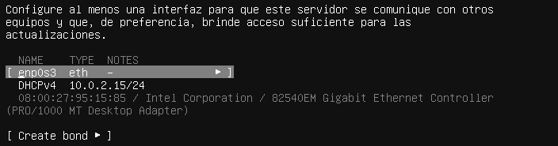

# Guia per a instal·lar "Docker Compose" Ubuntu Server 22.04.4
Esta guia ens servira perquè pugueu instal·lar el `Docker Compose` sense cap complicació a través d'este README.
## 1.Iniciar màquina virtual:
Quan iniciem per primera vegada la màquina virtual travessarem diferents tipus de pantalles que no entraré en detall, però n'hi ha una en la que és molt important què és la pantalla de la xarxa, allí configurarem el `DHCP` perquè s'assigne una IP de forma automàtica:
<br>
Ens fixem en l'apartat de `enp0s3` i li fem un "intro".<br>
<br>
Se'ns obrira un menú, ens fixem en l'opció de `Edit IPv4`, li fem un altre "intro".<br>
<br>
I ací posem que ens pose la IP de forma automàtica en l'opció de `Automàtic (DHCP)` i guardarem la configuració.<br>
<br>

## 2.Conectar ssh tant en Windows com en Linux(Ubuntu):
### 2.1.Actualitzar els paquets:
Abans de fer res actualitzarem tots els paquets per si algo ix mal:
- ```plaintext
    sudo apt update && sudo apt upgrade -y
    ```
- ### 2.2. Instal·lar ssh 
 - Windows (PowerShell)
    ```plaintext
    Get-Service -Name ssh-agent
    ```
 - Linux(Ubuntu)
    ```plaintext
    sudo apt install ssh
    ```
### 2.3.Saber sobre l'estat de ssh
 - Windows (PowerShell)
    ```plaintext
    Get-Service -Name ssh-agent
    ```
 - Linux(Ubuntu)
    ```plaintext
    sudo sytemctl status ssh
    ```
### 2.4.Com activar-lo tant de forma manual tant com de forma automàtica
#### 2.4.1 Activar-lo de forma manual
 - Windows (PowerShell)
    ```plaintext
    Start-Service ssh-agent
    ```
 - Linux(Ubuntu)
    ```plaintext
    sudo systemctl enable ssh
    ```
#### 2.4.2 Activar-lo de forma automàtica
 - Windows (PowerShell)
    ```plaintext
    Set-Service -Name ssh-agent -StartupType Automatic
    ```
 - Linux(Ubuntu)
    ```plaintext
    sudo systemctl enable --now ssh
    ```
## 3.Instal·lació de Docker
### 3.1.Instal·lació de Docker i els seus complements
Instal·lar Docker:
 - ```plaintext
    sudo apt install docker.io
    ```
Instal·lar els complements:
 - ```plaintext
    sudo apt install docker-compose-plugin
    ```
Ara necessitarem agregar el repositori oficial de Docker perquè funcione bé el Docker Compose.
 - ```plaintext
    sudo apt remove docker docker-engine docker.io containerd runc
    ```
 - ```plaintext
    sudo apt install ca-certificates curl gnupg
    ```
 - ```plaintext
    sudo install -m 0755 -d /etc/apt/keyrings
    ```
 - ```plaintext
    curl -fsSL https://download.docker.com/linux/ubuntu/gpg | sudo tee /etc/apt/keyrings/docker.asc > /dev/null
    ```
 - ```plaintext
    sudo chmod a+r /etc/apt/keyrings/docker.asc
    ```
 - ```plaintext
    echo \

    "deb [arch=$(dpkg --print-architecture) signed-by=/etc/apt/keyrings/docker.asc] https://download.docker.com/linux/ubuntu \

    $(lsb_release -cs) stable" | sudo tee /etc/apt/sources.list.d/docker.list > /dev/null
    ```
 - ```plaintext
    sudo apt update
    ```
Ara instal·larem "Docker Compose"
 - ```plaintext
    sudo apt install docker-ce docker-ce-cli containerd.io docker-buildx-plugin docker-compose-plugin
    ```
### 3.2 Preparació per a executar el fitxer "docker-compose.yaml"
Primer que tot necessitarem `scp` (Secure Copy), un comand que ens permet enviar fitxers d'un ordinador a l'altre, així és com s'instal·la:
 - Windows (PowerShell)
    ```plaintext
    Add-WindowsCapability -Online -Name OpenSSH.Client~~~~0.0.1.0
    ```
 - Linux(Ubuntu)
    ```plaintext
    sudo apt install openssh-client
    ```
Ara que ja ho tenim tot instal·lat procedim a copiar els mòduls a la màquina virtual:
 - Windows (PowerShell)
    ```plaintext
    scp C:\ruta\del\arxiu\docker-compose.yaml usuariServidor@ipServidor:/home/usuariServidor/ 
    ```
 - Linux(Ubuntu)
    ```plaintext
    scp /ruta/del/arxiu/docker-compose.yaml usuariServidor@ipServidor:/home/usuariServidor/
    ```
Ara necessitem tindre una carpeta anomenada `dev_addons` dins de la màquina virtual i posar els mòduls dins d'esta perquè a l'hora d'executar el `docker-compose.yaml` perquè si no fallara l'instal·lació perquè no existeix la carpeta `dev_addons`.
 - ```plaintext
   mv nomDirectori /home/usuari/dev_addons
   ```
Ara necessitem canviar l'extensió del fitxer `Dockerfile.txt` a `Dockerfile` perquè dirà que no troba `Dockerfile` perquè té l'extensió `txt`.
 - ```plaintext
   mv Dockerfile.txt Dockerfile
   ```
### 3.3 Execució del "docker-compose.yaml"
**(Opcional)** Pots fer que el teu usuari siga del grup de Docker per a no haver d'usar `sudo` cada vegada:
 - ```plaintext
   sudo usermod -aG docker UsuariServidor
   ```
Recorda canviar `UsuariServidor` pel nom del teu usuari de la màquina virtual.
 - ```plaintext
   su UsuariServidor
   ```

Abans d'executar res necessitem activar el docker:
 - ```plaintext
   sudo systemctl start docker
   ```
I si vols que s'inicie de forma automàtica quan encengues l'equip executa el següent:
 - ```plaintext
   sudo systemctl enable docker 
   ```
I per últim executa el `docker-compose.yaml`:
 - ```plaintext
   sudo docker compose up -d --build
   ```
Sí ix tot bé ja tindràs l'Odoo en Docker Compose, l'únic que hauras de fer és:
 - ```plaintext
   sudo docker ps
   ```
Per veure si esta executant, si no veus el teu contenidor o simplement en `status` està `stopped` i no `up` executa el següent comand:
 - ```plaintext
   sudo docker start <nom del contenidor>
   ```
Sols canvia `nom del contenidor` pel nom o id del contenidor de docker que el pots veure igualment amb `docker ps` en el apartat de `Container id` o `name`.
Per últim ens dirigim al navegador del nostre sistema real i col·locarem el següent:
 - ```plaintext
   http://ipServidor:8069
   ```
Canviem `ipServidor` per la ip que ens isca en el següent comand en la màquina virtual:
 - ```plaintext
   ip a
   ```
I sí quan poses el mencionat anteriorment apareix el següent, significa que ja ho tens preparat:<br>
<br>