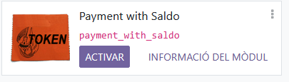

# Configuració de Odoo
## Primers pasos
Primer que tot el que n'hi ha que fer és encendre el docker si no el teniu encés:
- ```plaintext
   sudo systemctl start docker
   ```
I si vols que s'inicie de forma automàtica quan encenges l'equip executa el següent:
 - ```plaintext
   sudo systemctl enable docker 
   ```
I després serà posar la IP de la màquina i el port per on es connectarà el teu equip:
 - ```plaintext
   http://<IPServidorUbuntu>:<NumPort>
   ```
Heu de cambiar `IPServidorUbuntu`per la ip que apareix en el vostre sevidor de Ubuntu al fer el següent comand:
 - ```plaintext
   ip a
   ```
I `NumPort` per el port que s'assigna al `docker-compose.yaml` que en este cas és el 8069.
Ara, quan entreu al Odoo el que neccessitem fer és instal·lar els moduls principals els quals són el de Vendes i CRM, <br>
<br>
<br>
i per a habilitar els mòduls personalitzats el que heu de fer és:
## Afegir els fitxers de configuració
Per a afegir els fitxers de configuració d'Odoo tens que anar a la carpeta `config_odoo` en la màquina virtual de Ubuntu Server 22.04.4:
 - ```plaintext
   cd config_odoo
   ```
Ara necessitarem crear el fitxer `odoo.conf` i posar el següent:
 - ```plaintext
   nano odoo.conf
   ```
 - ```plaintext
   [options]
   addons_path = /mnt/extra-addons,/usr/lib/python3/dist-packages/odoo/addons
   db_host = db
   db_user = odoo
   db_password = myodoo
   log_level = info
   ```
i reiniciarem els contenidors de Docker:
 - ```plaintext
   sudo docker-compose up -d --build
   ```
 - ```plaintext
   sudo docker restart <nom_del_contenidor>
   ```
Cambia `nom_del_contenidor` per el que trobes en `docker ps`:
 - ```plaintext
   sudo docker ps
   ```
I amb això ja deuria de vore's tant les aplicacions com els mòduls personalitzats d'Odoo.<br>
<br>
<br>
<br>
