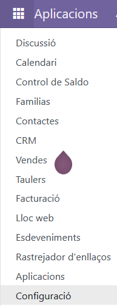
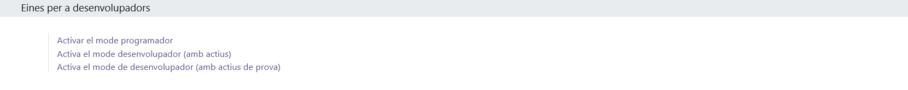
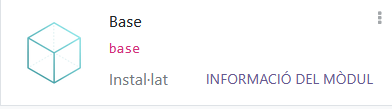
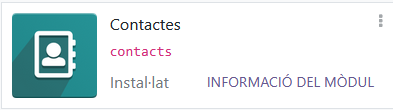
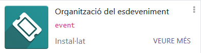
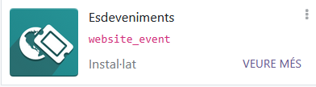
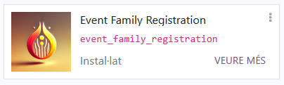
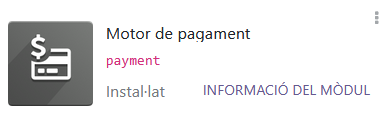
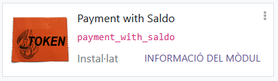

# Configuració de Odoo
## Primers pasos
Primer que tot el que s'ha de fer és encendre el docker si no el teniu encés:
- ```plaintext
   sudo systemctl start docker
   ```
I si vols que s'inicie de forma automàtica quan encengues l'equip executa el següent:
 - ```plaintext
   sudo systemctl enable docker 
   ```
I després serà posar la IP de la màquina i el port per on es connectarà el teu equip:
 - ```plaintext
   http://<IPServidorUbuntu>:<NumPort>
   ```
Heu de canviar `IPServidorUbuntu` per la ip que apareix en el vostre servidor d'Ubuntu al fer el següent comand:
 - ```plaintext
   ip a
   ```
I `NumPort` pel port que s'assigna al `docker-compose.yaml` que en este cas és el 8069.
Ara, quan entreu a l'Odoo el que necessitem fer és instal·lar els mòduls principals els quals són el de Vendes i CRM: <br>
<br>
<br>
i per a habilitar els mòduls personalitzats el que heu de fer és:
## Afegir els fitxers de configuració
Per a afegir els fitxers de configuració d'Odoo has d'anar a la carpeta `config_odoo` en la màquina virtual d'Ubuntu Server 22.04.4:
 - ```plaintext
   cd config_odoo
   ```
I abans d'entrar, per si de cas li modifiquem els permisos:
 - ```plaintext
   sudo chmod -R 777 config_odoo 
   ```
Ara necessitarem crear el fitxer `odoo.conf` i posar el següent:
 - ```plaintext
   nano odoo.conf
   ```
 - ```plaintext
   [options]
   addons_path = /mnt/extra-addons,/usr/lib/python3/dist-packages/odoo/addons
   db_host = db
   db_user = odoo
   db_password = myodoo
   log_level = info
   ```
i reiniciarem els contenidors de Docker:
 - ```plaintext
   sudo docker-compose up -d --build
   ```
 - ```plaintext
   sudo docker restart <nom_del_contenidor>
   ```
Cambia `nom_del_contenidor` pel que trobes en `docker ps`:
 - ```plaintext
   sudo docker ps
   ```

## Instal·lant els mòduls
Per a instal·lar els mòduls personalitzats el que tindràs que fer és activar el mode de desenvolupador, com ho fem?
### Activar el mode de desenvolupador
Ves a la interfície d'Odoo > Configuració > Eines de desenvolupador > Mode de desenvolupador
En la icona del quadret  li premes i veuràs el següent:<br>
<br>
Li premes a Configuració i baixes on veges eines de desenvolupador a la frase `Mode de desenvolupador`: 
<br>
I amb això ja s'hauria de veure tant les aplicacions com els mòduls personalitzats d'Odoo, però important, instal·la'ls en el següent ordre, perquè si no podria llançar un error que no has instal·lat aquell mòdul personalitzat.
### Mòdul de Saldo_favor
Primer instal·lat `Saldo a favor` com que gran part dels mòduls personalitzats hereten d'este últim, passa el mateix amb el mòdul personalitzat `familia`, però primer instal·lat els mòduls de `CRM` i `vendes`, segurament ja els tindràs instal·lats, però si no els tens, instal·la-te'ls perquè `Saldo_favor` els requerix per a funcionar.<br>
<br>
<br>
I amb això ja podràs instal·lar el mòdul de `Saldo_favor`.<br>
<br>
### Mòdul de Família
Per a `família` has de tindre els mòduls `base`, `contactes`, `vendes` i el mòdul personalitzat de `saldo_favor`<br>



<br>
I amb això ja podem instal·lar el mòdul de `Família`.<br>
<br>
### Mòdul d'Event_family_registration
Per a `Event_family_registration` has de tindre els mòduls de `events`, `vendes`, `website_events` i el mòdul personalitzat de `família` instal·lat per a poder instal·lar este.<br>



<br>
I amb això ja podríem instal·lar `Event_family_registration`.<br>
<br>
### Mòdul de Payment_with_saldo
Per a instal·lar `Payment_with_Saldo` el que has de fer és instal·lar el mòdul de `comerç electrònic`, `facturació`, `pagament` i els dos mòduls personalitzats de `saldo_favor` i `família` com que si no et donara un error en la instal·lació.<br>


<br>
I amb això ja pots instal·lar el mòdul de `Payment_with_Saldo`.<br>
<br>