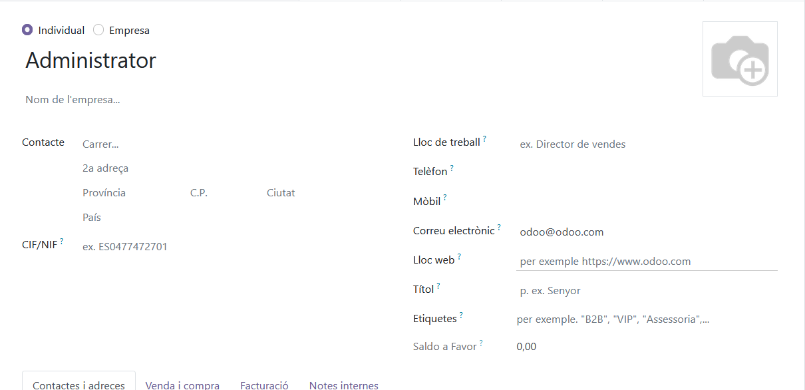
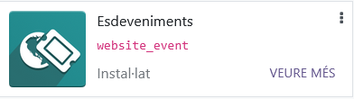
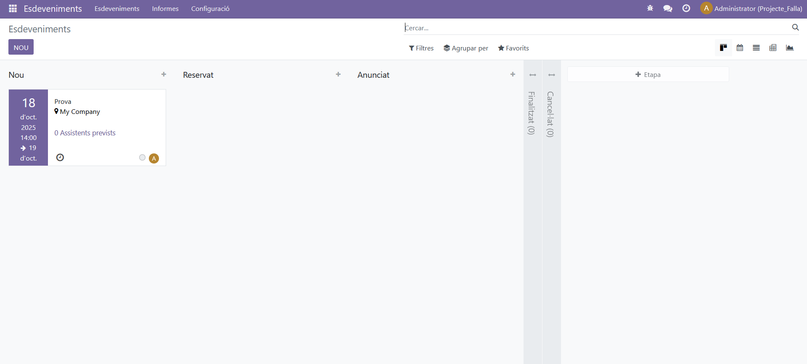
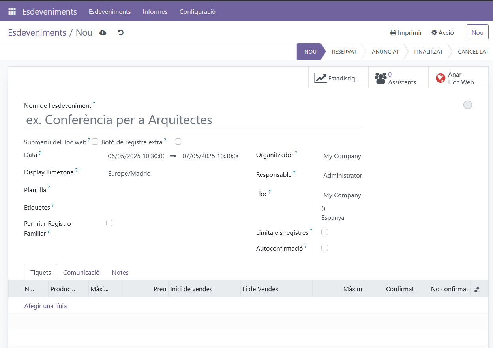
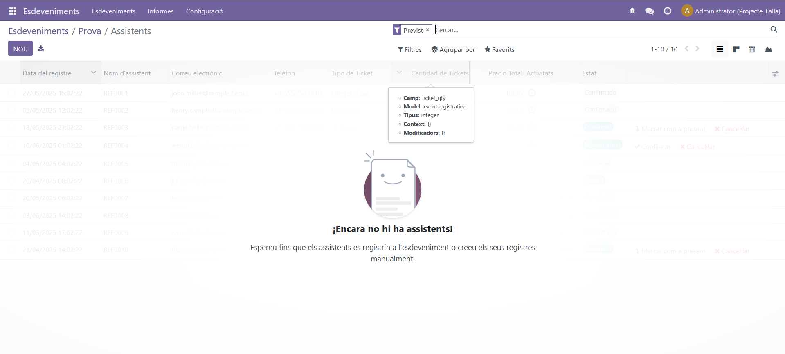
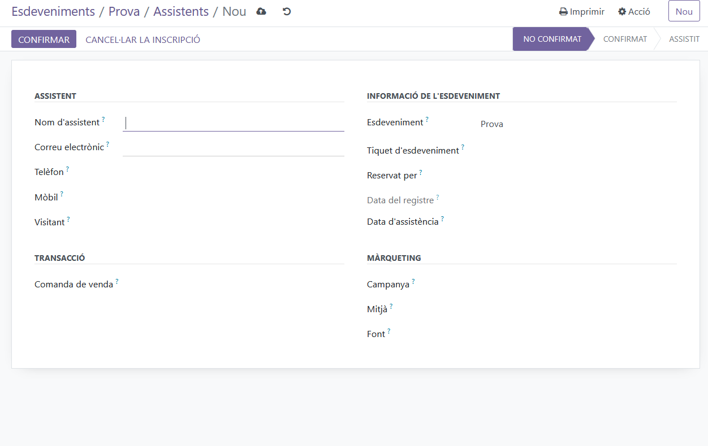

# apiOdoo
No precisament un mòdul d'Odoo, però el que fa és mitjançant `xmlrpc` es connecta a l'API d'Odoo i fa una petició que trau un event per pantalla i als seus participants que estiguen registrats en eixe event que tinguen un codi de barres en específic.

## 1. Accedeix al teu perfil
Primer, inicia sessió al teu compte d'Odoo. Fes clic a la teua foto o icona de perfil al cantó superior dret i selecciona **"El meu perfil"**.


---

## 2. Ves a la secció de seguretat del compte
Una vegada dins del teu perfil, selecciona la pestanya **"Seguretat del compte"**. Ací trobaràs l'opció per gestionar les teues claus d'API.


---

## 3. Crea una nova clau
Fes clic al botó **"Nova clau API"**. Apareixerà una finestra per a introduir una descripció de la clau.


### 3.1. Escriu una descripció
Introdueix una descripció clara per a identificar l'ús de la clau. Per exemple: *"Clau per a la connexió API"*.

---

## 4. Confirma la contrasenya
Per motius de seguretat, hauràs d'introduir la teua contrasenya d'Odoo per a confirmar la creació de la clau.


---

## 5. Guarda la clau generada
Una vegada creada, Odoo et mostrarà la clau de l'API. **És important guardar-la en un lloc segur**, ja que no es podrà recuperar més endavant. Utilitza aquesta clau en lloc de la teua contrasenya per a accedir a l'API d'Odoo.


---

## 6. Visualitza les claus existents
Pots veure totes les claus creades a la secció **"Claus API"** del teu perfil. Des d'ací també pots suprimir les claus que ja no necessites.


---

## Notes finals
- Utilitza la clau API per a connexions segures.
- No compartisques la teua clau amb altres persones.
- En cas de compromís, elimina la clau immediatament i genera una nova.


## Configuració

Assegurat de configurar correctament el fitxer `config.yml` amb les dades de connexió adequades per als entorns de producció i desenvolupament.
```yaml
production:    
    connection:
        url: http://localhost:8069/xmlrpc/2/common o http://IPMàquinaVirtual:8069/xmlrpc/2/common # localhost si Odoo està en la mateixa màquina i IP de la màquina virtual si està en un sistema diferent.
        port: 8069 # Port de l'Odoo
        db: nom_bd # Nom de la base de dades a través del següent enllaç 
        user: usuari # Correu electrònic configurat a l'usuari administrador d'Odoo
        password: **********47d1e3ac55********** # Api generada de l'Odoo

development:    
    connection:
        url: http://localhost:8069/xmlrpc/2/common o http://IPMàquinaVirtual/xmlrpc/2/common # localhost si Odoo està en la mateixa màquina i IP de la màquina virtual si està en un sistema diferent.
        port: 8069 # Port del Odoo
        db: nom_bd # Nom de la base de dades a través del següent enllaç 
        user: usuari # Correu electrònic configurat a l'usuari administrador d'Odoo
        password: **********47d1e3ac55********** # Api generada de l'Odoo
```
## Obtindre la IP de la màquina virtual
- Si no saps o si no recordes de la IP de la teua màquina virtual executa el següent:
  ```plaintext
  ip a
  ``` 
## Obtindre el nom de la base de dades

Si no recordes el nom de la teua base de dades, pots trobar-lo a la secció de configuració del teu compte d'Odoo. Pots accedir a la pàgina de gestió de bases de dades d'Odoo per veure totes les bases de dades disponibles. Ves a la següent URL i inicia sessió si és necessari:

- Si el teu domini és `http://localhost:NumPort` o `http://IPMàquinaVirtual:NumPort`, l'URL completa serà:
  ```plaintext
  http://localhost:8069/web/database/manager
  ```
  Això si és en localhost, però si és en la IP de la màquina virtual:
  ```plaintext
  http://IPMàquinaVirtual:8069/web/database/manager
  ```
---
## Obtindre el correu
Si no et recordes del correu electrònic pel motiu que siga fixat en esta icona i prems on diu `Contactes` i veuràs el següent:
<br>
I allí seleccionaràs al usuari administrador:<br>
<br>
Quan el selecciones veuràs el següent:
<br>
I ens fixarem on diu `Correu electrònic`, si té valor ja hem acabat, si no posa-li un correu electrònic.<br>
<br>

## Com crear un event
Per a crear un 'event' el que has de fer és tindre el mòdul `Events` instal·lat:<br>
<br>
Quan el tingues instal·lat el mòdul d'Events ens fixarem en esta icona  i premes on diu `Esdeveniments` i veuràs el següent:
<br>
Ara li premeràs on diu `Nou` i s'obrira el següent formulari:
<br>
Emplena el formulari, i si vols afegir a un contacte al event, hauràs de prémer el següent:<br>
<br>
S'obrira el següent i li premeràs al botó que diu `Nou`:
<br>
Quan premes el botó que diu `Nou s'obrira el següent`:
<br>
Emplena el formulari amb el contacte que vulgues i ja tens un esdeveniment amb un assistent.

Per a executar el script `main.py`, assegurat d'estar en un entorn de Python 3.5 o superior. Pots seguir estos passos:

1. Instal·la les dependències necessàries:
   ```sh
   pip install pyyaml
   ```
   ```sh
   pip install requests
   ``` 
   o
   ```sh
   pip install pyyaml requests
   ```
   o de forma més sencilla instal·la de forma directa del fitxer de `requirements que està en esta carpeta`
   ```sh
   pip install -r requirements.txt
   ```
2. Executa el script:
   ```sh
   python3 main.py
   ```

Això llegirà les propietats de connexió des del fitxer `config.yml` i construirà l'URL base per a XML-RPC.

## Contribuir

Si vols contribuir a este projecte, si us plau, fes un fork del repositori i envia una pull request amb les teues millores.

## Llicència

Este projecte està llicenciat baix la [Llicència MIT](LICENSE).