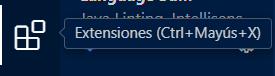

# gestio_falla

Aquesta aplicació de flutter té com a propòsit gestionar tots els esdeveniments, productes, tiquets..., etc. Gràcies a les polseres que funcionen amb la tecnologia NFC (Near-Field-Communication) i alternativament amb ús de QR (Quick-Response-Code) per als dispositius que no compten amb la tecnologia NFC en una sola aplicació.

---

## Taula de continguts
- [gestio_falla](#gestio_falla) 
  * [Requeriments previs](#requeriments-previs)
  * [Instal·lar flutter i com configurar-ho en VSCode](#installar-flutter-i-com-configurar-ho-en-vscode)
    + [Dependències per a Flutter](#dependències-per-a-flutter)
  * [Com crear un projecte de Flutter](#com-crear-un-projecte-de-flutter)
  * [Tipus de widgets en Flutter](#tipus-de-widgets-en-flutter)
  * [Tipus de dades de Dart](#tipus-de-dades-de-dart)
  * [Construcció de pantalles en Flutter](#construcció-de-pantalles-en-flutter)
  * [Creació de formularis](#creació-de-formularis)
  * [Navegació entre pantalles](#navegació-entre-pantalles)
  * [Estructura de l'aplicació](#estructura-de-laplicació)
    + [Presentation](#presentation)
    + [Domain](#domain)
    + [Infrastructure](#infrastructure)
    + [Gestor d’estats](#gestor-destats)
  * [Com crear l'arquitectura CLEAN en l'aplicació de Flutter](#com-crear-larquitectura-clean-en-laplicació-de-flutter)
    + [Capa d'Infraestructura](#capa-dinfraestructura)
      - [DataSource](#datasource)
        * [Sense crida a la API](#sense-crida-a-la-api)
        * [Amb crida a la API](#amb-crida-a-la-api)
      - [Implementació del repositori](#implementació-del-repositori)
    + [Capa de domini](#capa-de-domini)
      - [Entitats](#entitats)
      - [Repositori](#repositori)
    + [Capa de Presentació](#capa-de-presentació)
      - [Pantalles](#pantalles)
    + [Capa de gestor d’estats](#capa-de-gestor-destats)
      - [Provider](#provider)
  * [Dependències en el fitxer pubspec.yaml i com implementar-les](#dependències-en-el-fitxer-pubspecyaml-i-com-implementar-les)
    + [Llibreria de Provider](#llibreria-de-provider)
    + [NFC](#nfc)
    + [http](#http)
    + [MobileScanner (Per a codi QR)](#mobilescanner-per-a-codi-qr)
    + [Mostrar QR (qr_flutter)](#mostrar-qr-qr_flutter)
      - [Ruta per als permisos de la càmera](#ruta-per-als-permisos-de-la-càmera)
    + [Notificacions](#notificacions)
      - [Alteracions perquè funcione en la versió 15.1.1](#alteracions-perquè-funcione-en-la-versió-1511)
    + [Permisos](#permisos-1)
    + [Modificació per a posar el format d'hora que vulgues "intl"](#modificació-per-a-posar-el-format-dhora-que-vulgues-intl)
    + [Resum de les llibreries](#resum-de-les-llibreries)
    + [Posar una imatge](#posar-una-imatge)
    + [Posar una icona a l'aplicació](#posar-una-icona-a-laplicació)
    + [Resultat final del pubsec.yaml](#resultat-final-del-pubsecyaml)
  * [NFC](#nfc-1)
    + [Com llegir NFC](#com-llegir-nfc)
    + [Com escriure NFC](#com-escriure-nfc)
  * [QR](#qr)
    + [Com llegir QR](#com-llegir-qr)
    + [Com mostrar QR](#com-mostrar-qr)

<small><i><a href='http://ecotrust-canada.github.io/markdown-toc/'>Taula de continguts generada parcialment amb markdown-toc</a></i></small>

---

## Requeriments previs
Aquest apartat serveix per a advertir que no tots els dispositius Android ni Apple són compatibles en aquest projecte, perquè per exemple el lector de NFC requereix:
- Android: API 19 (Android 4.4 o també conegut com KitKat) <p>
I per a iOS heu d'utilitzar mínim aquesta gamma de dispositius:
- iOS (iOS 13): 
   - Mínim sense actualitzar: Tota la gamma dels iPhone 11
   - Mínim amb totes les actualitzacions proporcionades per Apple: iPhone 6s / 6s Plus / SE (1ª) 

**Nota**: Si treballes amb iOS, assegura’t de tindre Xcode actualitzat.

**Advertència per als que useu iOS**: Aquesta aplicació no està provada per a iOS, com que no dispose de cap dispositiu que compte amb iOS no he pogut realitzar les proves necessàries, i és probable que no funcione l'aplicació, esteu advertits...

**Atenció**: Alguns dispositius Android no tenen NFC. Comprova-ho amb `NfcManager.isAvailable()` del lector de NFC de l'aplicació.


---

## Instal·lar flutter i com configurar-ho en VSCode
Primerament instal·la el SDK de la [pàgina oficial de Flutter](https://docs.flutter.dev/get-started/install):
<p align= "center">
   
</p>
<p align="center"><em>Pas 1: Pàgina per a Instal·lar Flutter</em></p>

---

### Dependències per a Flutter

---

Per a provar les apps de flutter en Android has de tindre Android Studio segons els requisits de **flutter Doctor**, o simplement vols un emulador d'Android o veure el dispositiu físic en la pantalla del teu ordinador, Android Studio pot ajudar-te en aquest apartat.<p>
Per a veure si tens totes les ferramentes per a usar flutter pots saber-ho amb aquest comando:<p>

 ```bash
 # Comprovar l'estat del sistema amb Flutter
 flutter doctor
 ```

Ara que tenim el SDK instal·lat ara la pregunta és... On puc programar en Flutter?<p>
Pots programar Flutter en VSCode si primerament instal·les les següents extensions (Fixat que per a instal·lar extensions en VSCode és en la següent icona):<p>
<p>
<p align="center"><em>Pas 2: Icona d'extensions de Visual Studio Code</em></p>

Aquestes són les extensions que has d'instal·lar:

- Flutter

<p align= "center">
   
</p>
<p align="center"><em>Pas 3: Extensió de Flutter</em></p>

- Dart

<p align= "center">
   
</p>
<p align="center"><em>Pas 4: Extensió de Dart</em></p>

- Awesome Flutter Snippets

<p align= "center">
   
</p>
<p align="center"><em>Pas 5: Extensió de Awesome Flutter Snippets</em></p>

- Pubspec

<p align= "center">
   
</p>
<p align="center"><em>Pas 6: Extensió de pubspec</em></p>

---

## Com crear un projecte de Flutter
Per a crear un projecte de flutter necessitem executar el següent quan premem `Ctrl+Shift+P` en Visual Studio Code:

<p align= "center">
   
</p>
<p align="center"><em>Pas 1: Creació del projecte de Flutter</em></p>

```bash
# Crear nou projecte de flutter en VSCode
Flutter: New Project 
```
 

Quan premem la tecla *Enter* apareixerà el següent:
<p align= "center">
   
</p>
<p align="center"><em>Pas 2: Creació de l'aplicació de Flutter</em></p>

Haureu de prémer la primera opció (Application) esta generara tota l'estructura de directoris perquè pugueu executar l'aplicació de flutter en qualsevol dispositiu.<p>
Perquè genera les carpetes dels respectius sistemes operatius, ara hem d'assignar la carpeta a l'aplicació, en aquest cas la posaré dins de la carpeta *Projecte_Falla*:

<p align= "center">
   
</p>
<p align="center"><em>Pas 3: Assignació de la carpeta per a la aplicació de Flutter</em></p>

I després poseu el nom que vulgueu, en el meu cas es dirà *prova*:

<p align= "center">
   
</p>
<p align="center"><em>Pas 4: Nom de l'aplicació</em></p>

Al posar-li el nom, premeu la tecla *Enter* i se us generara de forma aproximada el següent:
```bash
# Estructura de directoris 
prova/
├── .dart.tool/
├── .idea/
│   ├── libraries/
│   │   ├── Dart_SDK.xml
│   │   └── KotlinJavaRuntime.xml
│   ├── runConfigurations/
│   │   └── main_dart.xml
│   ├── modules.xml
│   ├── workspace.xml
├── android/
│   ├── buildOutputcleanup/
│   │   ├── buildOutputcleanup
│   │   ├── cache.prperties
│   │   └── outputFiles.bin
│   ├── kotlin/
│   │   ├── errors/
│   │   └── sessions/
│   ├── noVersion/
│   │   └── buildLogic.lock/
│   ├── noVersion/
│   │   └── vcs-1/
│   ├── gc.properties
│   ├── app/
│   │   ├── .cxx/     
│   │   ├── src/
│   │   │   ├── debug/ 
│   │   │   │   ├── AndroidManifest.xml
│   │   │   ├── main/
│   │   │   │   └── java/
│   │   │   │   │   └── io/
│   │   │   │   │       └── flutter/
│   │   │   │   │           └── GeneratedPluginRegistrant.java
│   │   │   │   ├── kotlin/
│   │   │   │   │   └── MainActivity.kt
│   │   │   │   ├── res/
│   │   │   │   │   ├── drawable/
│   │   │   │   │   │   ├── launch_background.xml
│   │   │   │   │   ├── drawable-v21/
│   │   │   │   │   │   ├── launch_background.xml
│   │   │   │   │   ├── mipmap-hdpi/
│   │   │   │   │   │   ├── ic_launcher.png
│   │   │   │   │   ├── mipmap-mdpi/
│   │   │   │   │   │   ├── ic_launcher.png
│   │   │   │   │   ├── mipmap-xhdpi/
│   │   │   │   │   │   ├── ic_launcher.png
│   │   │   │   │   ├── mipmap-xxhdpi/
│   │   │   │   │   │   ├── ic_launcher.png
│   │   │   │   │   ├── mipmap-xxxhdpi/
│   │   │   │   │   │   ├── ic_launcher.png
│   │   │   │   │   ├── values/
│   │   │   │   │   │   ├── style.xml
│   │   │   │   │   └── values-night/
│   │   │   │   │       └── style.xml
│   │   │   │   └── AndroidManifest.xml    
│   │   │   └── profile/         
│   │   └── build.gradle.kts
│   ├── gradle/
│   ├── .gitignore
│   ├── build.gradle.kts
│   ├── prova_android.iml
│   ├── gradle.properties
│   ├── gradlew
│   ├── gradlew.bat
│   ├── local.properties
│   ├── settings.gradle.kts
├── build/
│   ├──reports
│   │   └──problems
│   │       └── problems-report.html
├── ios/
│   ├── Flutter/
│   │   ├── .AppFrameworkinfo.plist 
│   │   ├── Debug.xconfig
│   │   ├── flutter_export_environment.sh 
│   │   ├── Generated.xcconfig
│   │   └── Release.xcconfig
│   ├── Runner/
│   │   ├── Assets.xcassets/ 
│   │   ├── Base.Iproj/
│   │   ├── AppDelegate.swift
│   │   ├── GeneratedPluginRegistrant.h
│   │   ├── GeneratedPluginRegistrant.m
│   │   ├── Info.plist
│   │   └── Runner-Bridging-Header.h
│   ├── Runner.xcodeproj/
│   │   ├── project.xcworkspace/
│   │   │   ├── xcshareddata/
│   │   │   │   ├── IDEWorkspaceChecks.plist
│   │   │   │   └── WorkspaceSettings.xcsettings    
│   │   │   └── contents.xcworkspacedata
│   │   ├── xcshareddata/
│   │   │   └── xcschemes/
│   │   │       └── Runner.xcscheme
│   │   └── project.pbxproj
│   ├── Runner.xcworkspace/
│   │   ├── xcshareddata/
│   │   │   ├── IDEWorkspaceChecks.plist
│   │   │   └── WorkspaceSettings.xcsettings    
│   │   └──contents.xcworkspacedata    
│   ├── RunnerTests/
│   │   └── RunnerTests.swift
│   ├── .gitignore
├── lib/
│   ├── main.dart
├── linux/
│   ├── flutter/
│   │   └── ephemeral/
│   │       └── .plugin_symlinks/
│   ├── runner/
│   │   ├── CMakeList.txt
│   │   ├── main.cc
│   │   ├── my_application.cc
│   │   └── my_application.h       
│   ├── .gitignore
│   ├── CMakeList.txt
├── macos/ 
│   ├── Flutter/
│   │   ├── ephemeral/
│   │   │   ├── flutter_export_environment.sh
│   │   │   └── Flutter-Generated.xcconfig
│   │   ├── Flutter-Debug.xcconfig/  
│   │   ├── Flutter-Release.xcconfig/
│   │   └── GeneratedPluginRegistrant.swift/       
│   ├── Runner/
│   │   ├── Assets.xcassets/
│   │   │   ├── AppIcon.appiconset
│   │   │   │   ├── app_icon_16.png
│   │   │   │   ├── app_icon_32.png
│   │   │   │   ├── app_icon_64.png
│   │   │   │   ├── app_icon_128.png
│   │   │   │   ├── app_icon_256.png
│   │   │   │   ├── app_icon_512.png
│   │   │   │   ├── app_icon_1024.png
│   │   │   │   └── Contents.json  
│   │   ├── Base.Iproj/
│   │   │   └── MainMenu.xib
│   │   ├── Configs/
│   │   │   ├── AppInfo.xcconfig
│   │   │   ├── Debug.xcconfig
│   │   │   ├── Release.xcconfig
│   │   │   └── Warnings.xcconfig
│   │   ├── AppDelegate.swift
│   │   ├── DebugProfile.entitlements
│   │   ├── Info.plist
│   │   ├── MainFlutterWindow.swift
│   │   └── Release.entitlements      
│   ├── Runner.xcodeproj/
│   │   ├── project.xcworkspace/
│   │   │   └── IDEWorkspaceChecks.plist
│   │   ├── xcshareddata/ 
│   │   │   └── Runner.xcscheme 
│   │   └── project.pbxproj   
│   ├── Runner.xcworkspace/
│   │   ├── xcshareddata/
│   │   │   └── IDEWorkspaceChecks.plist
│   │   └── contents.xcworkspacedata  
│   ├── RunnerTets/
│   │   └── RunnerTests.swift  
│   └── .gitignore   
├── web/    
│   ├── icons/
│   │   ├── Icon-192.png 
│   │   ├── Icon-512.png
│   │   ├── Icon-maskable-192.png  
│   │   └── Icon-maskable-512.png  
│   ├── favicon.png
│   ├── index.html
│   ├── manifest.json 
├── windows/
│   ├── flutter/
│   │   ├── ephemeral/
│   │   │   └── plugin_symlinks
│   │   ├── Flutter-Debug.xcconfig/  
│   │   ├── Flutter-Release.xcconfig/
│   │   └── GeneratedPluginRegistrant.swift/ 
│   ├── runner/
│   │   ├── resources/
│   │   │   └── app_icon.ico
│   │   ├── CMakeLists.txt  
│   │   ├── flutter_window.cpp
│   │   ├── flutter_window.h
│   │   ├── main.cpp
│   │   ├── resource.h
│   │   ├── runner.exe.manifest
│   │   ├── Runner.rc
│   │   ├── utils.cpp
│   │   ├── utils.h
│   │   ├── win32_window.cpp
│   │   └── win32_window.h   
│   ├── .gitignore
│   └── CMakeLists.txt
├── .flutter-plugins
├── .flutter-plugins-dependencies
├── .gitignore
├── .metadata
├── analysis_options.yaml
├── devtools_options.yaml
├── prova.iml
├── pubspec.yaml
└── README.md              
```
I se us obrira el main automàticament amb el següent contingut:

<p align= "center">
   
</p>
<p align="center"><em>Pas 5: Contingut del fitxer main.dart de l'aplicació</em></p>

Ara si voleu veure que és premeu **F5** o en el terminal escriviu:
```bash
#Executar aplicació flutter
flutter run
```
Tardarà una estona en executar, però no us preocupeu, que la primera vegada en Android ha d'instal·lar-se l'aplicació i afegir les dependències a l'aplicació, però quan acabe obrira automàticament l'aplicació.<p>
Quan s'òbriga veureu el següent:

<p align= "center">
   
</p>
<p align="center"><em>Pas 6: El primer que veus al executar l'aplicació</em></p>

Com veieu no és més que un simple comptador que al prémer al botó de *+* augmentara el valor per 1:

<p align= "center">
   
</p>
<p align="center"><em>El que veus al prémer el botó de '+'</em></p>

Amb això ja tens una aplicació Flutter bàsica en funcionament.

---

## Tipus de widgets en Flutter
Quan creem una pantalla en Flutter podem fer que el widget de la pantalla tinga les següents característiques.
- Sense estat (**StatelessWidget**): Fa que la pantalla no s'actualitze davant els canvis.
- Amb estat (**StatefulWidget**): Fa que la pantalla sí s'actualitze davant els canvis amb *setState()*.
- Amb herència (**InheritedWidget**): És una classe base que permet propagar informació cap avall en l'arbre de widgets de Flutter<p>.
En general és recomanable que uses els widgets amb estat (*StatefulWidget*) perquè pots actualitzar dades, mentre que els widget sense estat (*StatelessWidget*) no actualitzen les dades i *InheritedWidget* s'usa de base en gestors d'estats avançats com *BLOC*, *Provider* o *Riverpod*.

---

## Tipus de dades de Dart
Dart compta amb els següents atributs per a assignar a variables:
- Numèrics: enters (**int**) i decimals (**double**),
- Cadenes de caràcters: **String**
- Valors lògics: **bool**
- Col·leccions d'objectes: Llistes (**List**), Conjunts (**Set**) i diccionaris (**Map**)
- Constants i finals: ```const nom="Joel"```, ```final String nom="Joel"``` 
- Null Safety i tractament de valors nuls: Dart és un llenguatge de tipat segur, el que significa que quan declarem una variable d'algun tipus, el compilador garanteix que els valors assignats siguen d'aquest tipus. Tot i que el tipat és obligatori, indicar el tipus d'una variable és opcional. En cas que no indiquem el tipus, aquest serà inserit a partir del valor amb què s'inicialitze. 
  Des de la versió 2.12 (març de 2021), Dart suporta també Null Safety, de manera que per defecte, una variable no podrà contenir valors nuls a no ser que s'especifique el contrari, estalviant així els problemes derivats de valors nuls. 
  Veiem els diferents operadors amb què podem tractar els nuls amb Dart:
   - Declaració de valor nullable (?): Si volem indicar de manera explícita que una variable pot contenir valors nuls, fem ús de l'interrogant en la seua declaració, tal i com es fa en altres llenguatges com Kotlin, ex: ```dart int? variable1; // variable1 podrà contenir el valor null ```
   - Operador d'asserció nul·la (null assertion operator) (!): S'utilitza quan volem assignar una variable que pot contenir nuls a variables que no en poden contenir, ex: ```dart int variable2=variable1!```.
   ```dart
   int? variable1;           // variable1 pot contenir nuls
   print(variable1);         // Mostrem variable1 (null)
   int variable2=variable1!; // variable2 no pot contenir nuls
                             // Excepció: Null check operator used on a null value
   print(variable2);         // Intentem mostrar variable2
   ```
   - Operador nul (??): Aquest operador retorna el valor resultant de l'expressió de la part esquera de l'operador, sempre que no siga nul. En cas contrari ens retornarà l'expressió de la dreta. Podem veure-ho com una mena d'operador condicional als valors nuls:
   ```dart
   var nom;
   // Escriu el nom si no és nul, o escriu "Anònim"
   print(nom ?? "Anònim");
   ```
   - Assignació conscient de nuls (null aware assignment) (??=): Assigna un valor a una variable si aquesta té valor nul. En cas que la variable tinga un valor prèviament diferent a null, no s'assignarà:
   ```dart
   int? variable1;   // Si no indiquem nullable donaria error
   print(variable1); // Mostra null
   variable1 ??= 10; 
   print(variable1); // Mostra "10"
   variable1 ??= 15; 
   print(variable1); // Mostra "10", ja que variable1 tenia ja valor.
   ```
   - Accés conscient de nuls (null-aware access)(?.): Evita que es llance una excepció quan s'accedeix a una propietat o mètode d'un objecte que pot ser nul.
   ```dart
   String? cadena;
   print (cadena?.length);
   ```
- Dynamic: (**dynamic**)<p>
   Dart és un llenguatge que suporta tant tipat estàtic com dinàmic. Quan parlem de tipat estàtic fem referència a que els tipus s'assignen en temps de compilació, pel que s'ha d'indicar el tipus de variable en la pròpia declaració, tal i com hem vist fins ara. Ara bé, Dart també suporta tipat de dades dinàmic, de manera que fa la comprovació de tipus en temps d'execució.

   Per a això, es fa ús del tipus dynamic, un tipus de dada subjacent a tots els objectes Dart, i que ens permet utilitzar tipat dinàmic de dades, de manera que la comprovació d'aquests tipus es realitza en temps d'execució en lloc de temps de compilació.

   Tenim més detalls a l'article [Dart is a Static or Dynamic typed Programming Language](https://medium.com/@farhanaslam910/dart-is-a-static-or-dynamic-typed-programming-language-3d934c95b7b) 
- Enumerats: (**enum**)<p>
   Els tipus enumerats en Dart (enum), com en altres llenguatges, ens serveixen per a representar un nombre fix de valors constants.

   Per exemple, podem definir un enumerat amb els dies de la setmana:

   `enum DiesSetmana { dilluns, dimarts, dimecres, dijous, divendres, dissabte, diumenge }`

   Internament, cadascun d'aquests valors es representa per l'índex que ocupa, sent el primer el 0.

   Per tal d'accedir a aquests valors, ho farem a través de la notació punt. Per exemple:

   `DiesSetmana dia=DiesSetmana.dilluns;` 

   Si volem obtenir una llista amb els valors de l'enumerat, farem ús de `values`:
   ```dart
   List<DiesSetmana> = DiesSetmana.values;   
   ```

---

## Construcció de pantalles en Flutter
Per a construir una pantalla en Flutter ens basarem en el projecte de prova, aleshores el que hem de fer és fxar-mon en l'apartat on diu:

```dart
@override 
Widget build(BuildContext context){

}
```
Això és el contingut on es mostrara per pantalla a l'executar l'aplicació, i no és com un fitxer normal, has d'utilitzar *widgets* per a desenvolupar com es veurà en pantalla, ací una xicoteta explicació d'alguns *widgets* del projecte de prova:
- **Scaffold**: Aquest widget conté l'estructura d'un disseny típic d'una aplicació basada en *Material Design*. A més dels components ja tractats (*appBar*, *body* i *floatingActionButton*), compta amb la possibilitat d'incloure elements de navegació o elements emergents, com els snackbars. Veiem algunes d'aquestes propietats:
   - **bottomNavigationBar**: Es tracta d'una barra de navegació (generalment un widget *BottomAppBar*) que s'afig a la part inferior de l'Scaffold.
   - **drawer**: La traducció literal d'un *Drawer* és caixonera, i consistix en un panell vertical, que generalment es mostra a l'esquerra del body, i que sol desplegar-se mitjançant un botó ubicat a la mateixa *AppBar*.
- **AppBar**: El widget de la barra d'aplicació (*AppBar*) consistix principalment en una barra d'eines, amb un títol (de vegades precedit d'una icona *leading*) i diverses opcions, mitjançant icones en la mateixa barra (*IconButtons*) o un menú (*Overflow Menu*) generat amb *PopupMenuButton*. Pot contindre també altres widgets com una barra de pestanyes (*TabBar*) o barres d'espai flexible (*FlexibleSpaceBar*).
- **Center**: Un widget de disposició, agafa a un fill (*widget*) amb el paràmetre *child* i el col·loca en el centre.
- **Column**: Un altre widget de disposició, agafa una llista de fills (*widgets*) amb el paràmetre *children*.
- **Text**: Un widget que permet crear textos amb estil. A més, recordem que una cadena de text pot incloure variables interpolades, fent ús del símbol **$** i si és necessari, també de les claus **{}**. En cas que fem ús d'interpolació, no haurem d'indicar que el text és constant. Veiem algunes propietats que ens poden ser d'utilitat:

   - **overflow**: Es tracta d'una propietat de tipus *TextOverflow*, que servix per a determinar què fer quan el text no cap al contenidor on es troba. Aquest tipus *TextOverflow* és un enumerat (*enum*), amb els possibles valors clip (retalla el contingut sobrant), el·lipsis (afig punts suspensius), fade (retalla el contingut sobrant de forma difuminada) o visible (fa visible el contingut).
   - **textAlign**: Per determinar l'alineació del text, mitjançant el tipus enumerat *TextAlign*, que admet els valors *center* (centrat), *end* (final), *start* (inici), *left* (esquerra), *right* (dreta) o *justified* (justificat). El fet de distingir entre *start/left* i *end/right* és per adaptar els textos als sistemes d'escriptura de dreta a esquerra.
   - **style**: Per determinar l'estil del text, mitjançant un widget de tipus *TextStyle*. Aquest widget admet una gran quantitat d'atributs, entre els que podem destacar:
      - **color**: Per establir el color del text. És un atribut del tipus *Color*, un valor de 32 bits expressat en format **ARGB** (Alpha-Red-Green-Blue). Podem expressar aquest color de diverses formes:<p>
      Directament, en format hexadecimal amb ***const Color(0xAARRGGBB)***, sent AA, RR, GG i BB, respectivament les quantitats de transparència (Alpha), Roig (Red), Verd (Green) i Blau (Blue).<p>
      Per exemple, per a un color blau sense transparència: ***const Color(0xFF42A5F5)***.
      Fent ús del constructor **fromARGB**, i especificant les quantitats en decimal (de 0 a 254). Per exemple, per al mateix blau: ***const Color.fromARGB(255, 66, 165, 245);***
      Fent ús de l'enumerat Colors, definit en *Material*, i que conté colors predefinits, com ***Colors.amber***, ***Colors.blue***, etc.
      - Color? **backgroundColor**: Amb el color de fons per al text, també amb un valor de tipus *Color*.
      - double? **fontSize**: Amb la grandària de la lletra, expressada en píxels lògics.
      - Fontweight? **fontWeight**: Amb el gruix de la lletra, i de tipus FontWeight, un enumerat amb els diferents gruixos.
      - Fontsyle? **fontStyle**: Amb l'estil de la font, del tipus enumerat *FontStyle* (normal, cursiva).
      - String? **fontFamily**: Per especificar la família tipogràfica a utilitzar. Prèviament a això, haurem d'incorporar les fonts al nostre projecte.
      A banda d'aquests, disposem de moltes propietats més per tal de definir l'estil. Podeu consultar-les totes de manera detallada a la documentació de Flutter.
- **Icon**: Permet posar una icona en l'aplicació, teniu tots els noms de les icones en la següent pàgina: [Pàgina d'icones de Flutter](https://api.flutter.dev/flutter/material/Icons-class.html).
- **FloatingActionButton**: Un botó que li pots assignar una funció en l'objecte *onPressed* i definir el contingut d'aquest en el seu fill amb el text definit anteriorment ***child: Text("+")*** o en el cas del fitxer `main.dart` és: ***child: const Icon(Icons.add)***.

---

## Creació de formularis
Per a crear un formulari en Flutter necessitarem del widget ***TextField***, aquest ens permet posar text amb el teclat, usat per a fer formularis i per a pantalles de **inici de sessió** compta amb les següents funcions:

   - bool **autofocus**: Per posar el *focus* de l'aplicació sobre aquest widget.
   - int? **maxLength**: Ens permet establir el nombre màxim de caràcters.
   - TextInputType? **keyboardType**: Estableix el tipus de teclat en funció de la informació a introduir. Per a això fa ús de la classe. *TextInputType*, amb valors com *TextInputType.datetime*, *TextInputType.emailAddress*, *TextInputType.multiline*, *TextInputType.name*, *TextInputType.number* o *TextInputType.phone*.
   - InputDecoration? **decoration**: Permet establir una decoració per a la caixa que envolta el widget.
   - bool **obscureText**: Es tracta d'un valor booleà per tal d'ocultar els caràcters que escrivim, en camps que puguen contenir informació sensible, com una contrasenya.
   - String **obscuringCharacter**: Ens permet modificar el caràcter a utilitzar per ocultar camps sensibles.
   - void Function(String)? **onChanged**: Es tracta d'una propietat que conté una funció de callback que es dispara quan el valor del text canvia.
   - TextEditingController? **controller**: Ens permet controlar el text contingut al *TextView*.

---

## Navegació entre pantalles
Ací usarem l'aplicació del projecte per a veure la navegació entre pantalles, en la meua aplicació estan les següents formes de navegar entre pantalles:
- **Navigator.push(context,MaterialPageRoute());**: Navegació que permet avançar a la següent pantalla i pots retrocedir a la pantalla anterior quan vulgues.
- **Navigator.of(context).pushReplacement(MaterialPageRoute());**: Navegació que permet avançar a la següent pantalla, però no pots retrocedir a la pantalla anterior.
- **Navigator.of(context).pushAndRemoveUntil(MaterialPageRoute(),(route) =>; false,);**: Navegació similar a *pushReplacement*, però una diferència substancial és que esborra totes les altres pantalles carregades que anaven darrere.

---

## Estructura de l'aplicació
L'aplicació flutter té la següent estructura de directoris:
```bash
#Estructura de directoris del projecte principal
lib/
├── assets/
│   ├── logo/
│   │   └── foreground.png
│   └── FallaPortal.png
├── domain/
│   ├── entities/
│   │   ├── cobrador.dart
│   │   ├── event.dart
│   │   ├── faller.dart
│   │   ├── producte.dart
│   │   └── ticket.dart
│   └── repository/
│   │   ├── Api-Odoo_repository.dart
│   │   ├── mostraQR_repository.dart
│   │   ├── nfc_repository.dart
│   │   ├── notificacions_repository.dart
│   │   └── qr_repository.dart
├── infrastructure/
│   ├── data_source/
│   │   ├── Api-Odoo_datasource.dart
│   │   ├── Fake_Api-Odoo_datasource.dart
│   │   ├── mostraQR_datasource.dart
│   │   ├── nfc_datasource.dart
│   │   ├── notificacions_datasource.dart
│   │   └── qr_datasource.dart
│   └── repository/
│   │   ├── Api-Odoo_repository_impl.dart
│   │   ├── mostraQR_repository_impl.dart
│   │   ├── nfc_repository_impl.dart
│   │   ├── notificacions_repository_impl.dart
│   │   └── qr_repository_impl.dart
├── presentation/
│   ├── screens/
│   │   ├── admin_screen.dart
│   │   ├── afegir_membre.dart
│   │   ├── barra_screen.dart
│   │   ├── crear_familia_screen.dart
│   │   ├── descompta_cadira_screen.dart
│   │   ├── editar_perfil_screen.dart
│   │   ├── editar_usuari_screen.dart
│   │   ├── escaner.dart
│   │   ├── escudellar_screen.dart
│   │   ├── event_detallat_screen.dart
│   │   ├── events_screen.dart
│   │   ├── login_screen.dart
│   │   ├── mostra_QR_screen.dart
│   │   ├── perfil_screen.dart
│   │   ├── principal_screen.dart
│   │   ├── registrar_screen.dart
│   │   └── splash_screen.dart
│   ├── themes/
│   └── widgets/
├── provider/
│   ├── Api-OdooProvider.dart
│   ├── mostraQRProvider.dart
│   ├── nfcProvider.dart
│   ├── notificacionsProvider.dart
│   └── qrProvider.dart  
└── main.dart
```
Esta estructura de directoris seguix l'arquitectura *CLEAN* o també coneguda com *Clean Architecture*, i ho explicaré de forma resumida en els següents punts:
- Presentation
- Domain
- Infrastructure
- Gestor d'estats

---

### Presentation
---
**UI**: Interfície de l’aplicació (el que es mostrara en l'app).

---

### Domain
---	
**Repository(implementació)**: Implementa les funcions del DataSource, hereta del Repository (sense implementació) i l’usa la interfície **(UI)**.
**Entities**: Els objectes de l’aplicació que rebran els canvis.

---

### Infrastructure

---	

**Repository**: Capa intermèdia que connecta i implementa el DataSource i heretara la implementació del Repositori en la capa de **Domain**.
**DataSource**: Capa que fa peticions a **APIs** o a altres llocs per a arreplegar la informació i després mostrar-la en la interfície **(UI)**.

---

### Gestor d’estats
---
**Provider**: Gestor d’estat per a saber l’estat de les peticions.

Ací deixe una imatge que resumeix l'arquitectura CLEAN de forma simplificada.
<p align= "center">
   
</p>

---

## Com crear l'arquitectura CLEAN en l'aplicació de Flutter
En el vostre projecte de Flutter per a seguir amb l’arquitectura CLEAN heu de seguir la següent cadena de directoris:
<p align= "center">
   
</p> 

---

### Capa d'Infraestructura
---
Primerament creem la següent cadena de carpetes si no les teniu creades:
<p align= "center">
   
</p> 
<p align="center"><em>Pas 1: Creació de les carpetes de DataSource i Repositori</em></p>

---

#### DataSource
Este apartat es dividira en 2 parts:
- DataSources que no fan falta cridar a la API.
- DataSources que necessiten cridar a la API per a poder executar-se.

---
##### Sense crida a la API
---
Anem a la carpeta de **data_source** i creem un nou fitxer:
 
<p align= "center">
   
</p> 
<p align="center"><em>Pas 2: Creació del fitxer DataSource</em></p>

Ara en el fitxer inicialitzarem la classe si volem afegir alguna variable si volem, en esta circumstancia com no fa falta ho deixem buit.
<p align= "center">
   
</p> 
<p align="center"><em>Inicialització de la classe</em></p>

**Nota**: Sí en algun moment ix un error, considera prémer `Ctrl+.` on està l'error, i et traura una llista de les possibles solucions, no sempre funciona, però pot ajudar-te en un moment difícil.<p>

Quan ja hem inicialitzat el DataSource farem les funcions que faran falta, com ací sols és una i és molt senzilla sols torna el valor de forma asíncrona per a poder mostrar un QR que està en la pantalla, sols ens interessa el valor que tindrà el QR, així que la implementem:
<p align= "center">
   
</p> 
<p align="center"><em>Funcions del DataSource</em></p>

Quan implementem la funció hauria de quedar de la següent forma:
<p align= "center">
   
</p>

<p align="center"><em>Pas 5:Classe completa del DataSource</em></p>

---
##### Amb crida a la API
Desenvolupem el DataSource com abans, però la diferencia ve en la funció i en el que demanem, recomane posar com a requerit la URL de base per a no tindre que escriure-la a cada poc:

<p align= "center">
   
</p>
<p align="center"><em>Pas 2: URL de base requerida</em></p>
Ara en la funció farem una petició a la API amb la url base i el endpoint necessari, i ho farem de la següent forma:
<p align= "center">
   
</p>
<p align="center"><em>Pas 3: Petició al backend amb la url i l'endpoint</em></p>

Ara farem la petició del tipus que siga en el backend, pot ser `GET` (obtindre), `POST` (insertar), `PUT` o `UPDATE` (actualitzar) i/o `DELETE` (borrar):

<p align= "center">
   
</p>
<p align="center"><em>Pas 4: Tipus de petició del backend</em></p>
I per últim, aquest pas es opcional, però es recomanable fer-lo, agafem l'estat del `http` i si és 200 que agafe la petició, si no que mostre un error:
<p align= "center">
   
</p>
<p align="center"><em>Pas 5: Comprovació si la petició ha sigut exitosa o no</em></p>

Aíxi deuria de quedar al final el DataSource amb la petició a la API:
<p align= "center">
   
</p>

<p align="center"><em>Pas 6: Classe completa del DataSource amb la petició a la API</em></p>

La resta no entraré en profunditat perquè essencialment és el mateix.

---

#### Implementació del repositori

---
Anem a la carpeta del **repositori** i creem un nou fitxer:
<p align= "center">
   
   <p align="center"><em>Pas 1: Creació de la carpeta de la implementació del repositori</em></p>
<p align= "center">
   
</p> 
<p align="center"><em>Pas 2: Creació del fitxer de la implementació del repositori</em></p>

Quan creem la classe és important que implemente al repositori (sense implementació) perquè herete totes les funcions del repositori (sense implementació) i les pugues implementar: 
<p align= "center">
   
</p>
<p align="center"><em>Pas 3: Implementació del repositori (sense implementació)</em></p>

Per a fer les funcions del repositori és important que s’inicialitze el DataSource, perquè usarem aquest últim per a fer les funcions i estalviar-mon codi:
<p align= "center">
   
</p>
<p align="center"><em>Pas 4: Inicialització del DataSource</em></p>

Com he dit abans les funcions seran exactament les mateixes que el repositori (sense implementació) així que és important que dalt de la funció poseu `@override` perquè sobreescriurà la funció del repositori (sense implementació) i cridarem a la instància de DataSource que havíem creat abans:
<p align= "center">
   
</p> 
<p align="center"><em>Pas 5: Funcions del repositori (implementació) amb "@override" del repositori (sense implementació)</em></p>

Al final deuria quedar de la següent forma:
<p align= "center">
   
</p> 
<p align="center"><em>Pas 6: Resultat de la implementació del repositori</em></p>

---

### Capa de domini

---
Primerament creem la següent cadena de carpetes si no les teniu creades:
<p align= "center">
   
</p> 
<p align="center"><em>Pas 1: Creació de les carpetes de Domini i Repositori</em></p>

---

#### Entitats

---
En esta funció l'entitat no forma part directament la funció, però com en la pantalla que implementem l'arquitectura parlaré un poc d’esta, així que anem a la carpeta d'entitats:
 <p align= "center">
   
</p>
<p align="center"><em>Pas 2: Creació de la carpeta d'entitats</em></p>


Per al exemple mirarem la meua entitat faller:

<p align= "center">
   
</p>
<p align="center"><em>Pas 3: Creació de la carpeta d'entitats</em></p>

Primer creem la classe Faller:
<p align= "center">
   
</p>
<p align="center"><em>Pas 4: Creació del fitxer faller.dart</em></p>

Després definim les propietats que tindrà la classe Faller:
<p align= "center">
   
</p>
<p align="center"><em>Pas 5: Creació de les propietats de la classe Faller</em></p>

**Atenció**: Us heu fixat en la propietat rolsValids? Té una llista de Strings constant, que significa? Significa que en eixa llista sols es poden acceptar els valors que estan dins d'eixa llista, que en el constructor es revisara amb el rol que té, si coincideix algun dels valors correcte, si no, dona error mirem-ho amb un exemple:

```dart
static const List<String> rolsValids = ['Faller', 'Cobrador','Cap de familia','Administrador','SuperAdmin']; //Llista de rols vàlids

rol = "Faller" 
rolsValids.contains(rol) //Correcte

rol = "Jefe" 
rolsValids.contains(rol) //Error
```

I quan les tenim les passem al constructor, si alguna de les propietats es nul·lable no és recomanable que siga requerida.<p>
**Exemple del constructor amb propietats nul·lables i no nul·lables**
```dart
String id, //Propietat no nul·lable
String? fotoPerfil //Propietat nul·lable
Faller({
   required this.id, //Com aquesta propietat no és nul·lable la demanem com a requerida
   this.fotoPerfil //Com aquesta propietat és nul·lable no la demanem com a requerida, sinó més com una propietat opcional
});
```

Ja explicat, ací mostre el constructor de la classe Faller:

<p align= "center">
   
</p>
<p align="center"><em>Pas 6: Constructor de la classe Faller</em></p>

Com he explicat abans la llista de rols vàlids comprova si rol conté alguna de les seues variables, i en el constructor es pot fer condicions per a verificar si rol conté algun element de la llista de rols vàlids.

<p align= "center">
   
</p>
<p align="center"><em>Pas 7 (opcional): Condicions del constructor</em></p>

Per últim si vols que en algun moment la teua aplicació puga rebre dades des del backend en forma de JSON aleshores has d'usar les propietats `fromJSON` i `toJSON`, sols assegurat que les propietats en JSON les poses igual en la crida al JSON, perquè si no serà nul:
<p align= "center">
   
</p>
<p align="center"><em>
  Pas 8: Funció fromJSON de la classe Faller
</em></p>

`fromJSON` llegirà les dades del backend en JSON.

<p align= "center">
   
</p>
<p align="center"><em>
  Pas 9: Funció toJSON de la classe Faller
</em></p>

I `toJSON` enviara les dades al backend en forma de JSON.

---

#### Repositori

---
Anem a la carpeta de repositoris i creem un nou fitxer:
<p align= "center">
   
</p>
<p align="center"><em>Pas 1: Creació de la carpeta de Repositori</em></p> 
<p align= "center">
   
</p> 
<p align="center"><em>Pas 2: Creació del fitxer de Repositori</em></p> 
Ara per a crear la classe l'hem de fer abstracta perquè serveixen per a definir una estructura comuna o un contracte que altres classes han de seguir, però sense implementar completament els detalls, aleshores implementem la classe abstracta:
<p align= "center">
   
</p> 
<p align="center"><em>Pas 3: Implementació de la classe abstracta del repositori</em></p>

I per últim fem les funcions que han de ser iguals al DataSource perquè el repositori amb implementació puga usar el DataSource: 
<p align= "center">
   
</p>  
<p align="center"><em>Pas 4: Funcions del repositori</em></p>

Al final deuria quedar de la següent forma:
<p align= "center">
   
</p>  
<p align="center"><em>Pas 5: Resultat del repositori</em></p>

---

### Capa de Presentació

---
Creeu la següent cadena de carpetes si no les teniu creades:
<p align= "center">
   
</p> 
<p align="center"><em>Pas 6: Creació de les carpetes de screens, themes i widgets</em></p>

**Aclariment**: Sols tinc les pantalles perquè no me s’ha vingut al cap algun widget personalitzat o un tema en específic.

#### Pantalles

---

Ací és on ocorrerà la màgia que aparega en la pantalla, no n’hi ha molt més misteri, sols que ací podràs aplicar tant els DataSources, repositoris i/o gestors d’estats (BLOC, Provider, Riverpod..., etc).<p>

Sols tin en compte que perquè es vegen les coses en la pantalla fa falta tindre `widget build` i usar tots els widgets esmentats anteriorment, sols comentar com pots tindre la pantalla tant en horitzontal com en vertical sense que se sobreïsca, haureu de posar el següent en el `widget build`:
```dart
  @override
  Widget build(BuildContext context) {
   return Scaffold(
      body: SafeArea(
        child: LayoutBuilder(
          builder: (context, constraints) {
            return SingleChildScrollView(
              child: ConstrainedBox(
                constraints: BoxConstraints(
                  minHeight: constraints.maxHeight,
                ),
                child: Center(
                  //Resta del codi
                ),
              ),
            );
          },
        ),
      ),
    );
  }
```
El que fa tot este codi és que transforma la pantalla en una pantalla en *`scroll`* per a que pugues navegar per les parts que no es vegen per pantalla tant de forma vertical com de forma horitzontal.

---

### Capa de gestor d’estats

---

#### Provider

---
Provider és un gestor d’estat més avançat i més senzill que BLOC, un altre gestor de l’estat, ara diré com podeu implementar provider en els vostres projectes:

1. Implementar la llibreria de provider en el pubspec.yaml

Anem al fitxer de **`pubspec.yaml`** que és troba en la carpeta de **lib**
<p align= "center">
   
   <p align="center"><em>Pas 1: Fitxer pubspec.yaml</em></p>
</p> 
I posarem el següent en l'apartat de `dependències`:
<p align= "center">
   
</p> 
<p align="center"><em>Pas 2: Confguracó del fitxer pubspec.yaml</em></p>

2. Tindre tant la capa de serveis tant la de repositori ja feta.

<p align= "center">
   
</p> 
<p align="center"><em>
   Pas 3:<br>
   Fixeu-vos en les carpetes de:<br>
   domain -> repository<br>
   infrastructure -> repository i datasource</em></p>

3. Crear la capa de provider en la carpeta anomenada “lib”. 

<p align= "center">
   
</p>
<p align="center"><em>Pas 4: Creació de la carpeta de providers</em></p>

4. Crear el fitxer “nomdelafuncioProvider".dart i al crear la classe que implemente “ChangeNotifier”.
 
 <p align= "center">
   
</p>
<p align="center"><em>Pas 5: Implementació de 'ChangeNotifier' en el provider</em></p>

5. Inicialitza el provider amb el repositori.
 
<p align= "center">
   
</p>
<p align="center"><em>Pas 6: Inicialització del repositori en el provider</em></p>

6. Completar el provider amb les funcions del repositori.
 

 <p align= "center">
   
</p>
<p align="center"><em>
   Pas 7:<br>
   Funcions bàsiques del provider que es veuran en la pantalla<br>
   +<br>
   Inicialització del repository al provider<br>
   Funció que implementa el repositori i mostrarà o guardarà en una variable de provider perquè es puga veure per pantalla<br>
</em></p>
El fitxer provider deuria quedar de la següent forma:

<p align= "center">
   
</p>
<p align="center"><em>Pas 8: Resultat del provider</em></p>

7. Inicialitzar al fitxer “main.dart”.

<p align= "center">
   
</p> 
<p align="center"><em>Pas 9: Fitxer main.dart</em></p>
<p align= "center">
   
</p>
<p align="center"><em>
   Pas 10: Inicialització del datasource i el repositori (la implementació)
</em></p> 

<p align= "center">
   
</p>
<p align="center"><em>
   Pas 11: Implementem el repositori i fem que el fitxer main el requerisca per a funcionar
</em></p>


<p align= "center">
   
</p> 
<p align="center"><em>
   Pas 12: Per últim posem el repositori que havíem inicialitzat al principi
</em></p>

8. Fer que retorne “Multiprovider” per a tindre una llista de providers.
<p align= "center">
   
</p> 
<p align="center"><em>
   Pas 13: Fem que en lloc de retornar MaterialApp retorne el Multiprovider i el MaterialApp serà un fill de Multiprovider per a implementar la resta del main amb normalitat.
</em></p>
 
Al final el fitxer main deuria quedar de la següent forma:

<p align= "center">
   
</p>
<p align="center"><em>Pas 14: Fitxer main.dart</em></p>

9. En la pantalla que vulgues, inicialitza la funció amb “Provider.of<nomdelafuncioProvider>;”.
<p align= "center">
   
</p>

<p align="center"><em>
  Pas 15: Inicialitzem el provider i li posem el valor de la funció que demanava (en este cas concret és un objecte de tipus String, però no n’hi haurà problema a l’hora de mostrar-lo).
</em></p>

Ara en la funció inicialitzada la implementem en la pantalla:
<p align= "center">
   
</p>
<p align="center"><em>
  Pas 15: En el widget Consumer posem el nom de la classe de Provider i en el seu constructor (builder) posem el provider i ja podem usar la funció de provider dins de la pantalla.
</em></p>
I amb això ja pots usar la teua funció provider en qualsevol lloc de l’aplicació.
<p align= "center">
   
</p>
<p align="center"><em>
  Pas 16: En aquest exemple com és un codi QR no es veu molt bé el resultat, però com el codi és generat per un “String” es pot veure de forma clara com s’ha dibuixat en la pantalla.
</em></p>

---

## Dependències en el fitxer pubspec.yaml i com implementar-les
### Llibreria de Provider

---

 Gestor d'estat de flutter, cal posar el següent en el yaml en l'apartat de `dependencies`:
 ```yaml
dependencies:
   provider: ^6.1.4  #Versió de Provider utilitzada 
 ```
 I per últim executem en el terminal:
 ```plaintext
 flutter pub get
 ```
 Més documentació a [la pàgina oficial](https://pub.dev/packages/provider)

---

### NFC

---
 Esta llibreria incorpora la capacitat de poder llegir etiquetes nfc, cal posar el següent en el yaml en l'apartat de `dependencies`:
 ```yaml
dependencies:
   nfc_manager: ^3.2.0  #Versió de nfc_manager utilitzada 
 ```
 Ara en el `AndroidManifest.xml` necessitarem posar el següent en l'apartat de `manifest`:
 ```xml
 <uses-permission android:name="android.permission.NFC"/>
 <uses-feature android:name="android.hardware.nfc" android:required="true"/>
 ```
 I per últim executem en el terminal:
 ```plaintext
 flutter pub get
 ```
 Més documentació en [la pàgina oficial](https://pub.dev/packages/nfc_manager)

---

### http

---
 Esta llibreria ens servira per a poder connectar-mon a l'API d'Odoo, cal posar el següent en el yaml en l'apartat de `dependencies`:
 ```yaml
dependencies:
   http: ^1.3.0  #Versió de http utilitzada 
 ```
 I per últim executem en el terminal:
 ```plaintext
 flutter pub get
 ```
 Més documentació en [la pàgina oficial](https://pub.dev/packages/http)

---
### Mostrar QR (qr_flutter)

---

 Esta llibreria ens permet generar codis QR en la nostra aplicació, cal posar el següent en el yaml en l'apartat de `dependencies`:
  ```yaml
dependencies:
   qr_flutter: ^4.0.0 #Versió de qr_flutter utilitzada
  ```
Després executem en el terminal:
 ```plaintext
 flutter pub get
 ```
  Més documentació en [la pàgina oficial](https://pub.dev/packages/qr_flutter)

---

### MobileScanner (Per a codi QR)

---

 Esta llibreria ens dona la capacitat de llegir codis QR, cal posar el següent en el yaml en l'apartat de `dependencies`:
 ```yaml
dependencies:
   mobile_scanner: ^3.0.0 #Versió de mobile_scanner utilitzada
 ```
 Ara executem:
 ```plaintext
 flutter pub get
 ```

 Més documentació en [la pàgina oficial](https://pub.dev/packages/mobile_scanner)

---

 #### Ruta per als permisos de la càmera

---

 Per a poder llegir codis QR necessitarem la càmera, i per això hi haurà que demanar permisos de la següent forma:
 Anem al `AndroidManifest` que es troba en la següent ruta:
 ```plaintext
 /android/src/AndroidManifest.xml
 ```
 Tindrem que posar el següent en l'apartat de `manifest`:<br>
 ```
 <manifest xmlns:android="http://schemas.android.com/apk/res/android">
 ...
 <uses-permission android:name="android.permission.CAMERA"/>
 <uses-feature android:name="android.hardware.camera" android:required="false"/>
 ```

---

### Notificacions
 Esta llibreria ens permetrà manar notificacions al mòbil, cal posar el següent en el yaml en l'apartat de `dependencies`:
 ```yaml
dependencies:
   flutter_local_notifications: 15.1.1  #Versió de flutter_local_notifications utilitzada 
 ```

---

#### Alteracions perquè funcione en la versió 15.1.1

---

 Necessiteu anar al fitxer en `FlutterLocalNotificationsPlugin.java` que és troba en:
 - Windows:
 ```plaintext
 C:\Users\usuari\AppData\Local\Pub\Cache\hosted\pub.dev\flutter_local_notifications-15.1\android\src\main\java\com\dexterous\flutterlocalnotifications\FlutterLocalNotificationsPlugin.java
 ```
 - Linux:
 ```plaintext
 /home/usuari/.pub-cache/hosted/pub.dev/flutter_local_notifications-15.1.1/android/src/main/java/com/dexterous/flutterlocalnotifications/FlutterLocalNotificationsPlugin.java
 ```
 
 El que teniu que canviar d'aquest fitxer és el següent:<p>
 **Nota**:Si ho feu en VSCode aconselle que premeu Ctrl+f per a obrir un buscador i posar la línia que volem modificar perquè el fitxer és molt llarg
 
 ```plaintext
 bigPictureStyle.bigLargeIcon(null);
 ```
 Ho canviem a:
 ```plantext
 bigPictureStyle.bigLargeIcon((Bitmap) null);
 ```
 Ho canviem degut a que elimina la ambigüitat perquè li diu al compilador que use la versió  `bigLargeIcon(Bitmap)`.<p>
 I per últim executem en el terminal:
 ```plaintext
 flutter pub get
 ```
 Més documentació de les versions més actuals en [la pàgina oficial](https://pub.dev/packages/flutter_local_notifications)

 ---

### Permisos

---

 Esta llibreria ens permetrà fer que funcionen les notificacions, cal posar el següent en el yaml en l'apartat de `dependencies`:
 ```yaml
dependencies:
   permission_handler: ^11.0.0  #Versió de permision_handler utilitzada 
 ```
 Ara en el fitxer anomenat `AndroidManifest.xml` posarem el següent en el `manifest`:
 ```xml
 <uses-permission android:name="android.permission.POST_NOTIFICATIONS" />
 ```
 I per últim executem en el terminal:
 ```plaintext
 flutter pub get
 ```

---

### Modificació per a posar el format d'hora que vulgues "intl"

---

 Esta llibreria ens permet posar el format d'hora que nosaltres vullgam potser tant *hh:mm:ss aaaa-mm-dd* com *dd-mm-aaaa hh:mm:ss* perquè `DateTime` usa per defecte *mm/dd/aaaa hh:mm:ss* per exemple, cal posar en el següent en l'apartat de `dependencies`:
  ```yaml
dependencies:
   intl: ^11.0.0  #Versió de intl utilitzada 
 ```
 Més documentació en [la pàgina oficial](https://pub.dev/packages/permission_handler)

---

### Resum de les llibreries

---

En resum, ací un resum de les llibreries que heu de posar al `pubspec.yaml` junt amb la versió utilitzada en el projecte i la funcionalitat de cadascuna:

| Llibreria                         | Funcionalitat                                                            | Versió      |
|:----------------------------------|:-------------------------------------------------------------------------|------------:|
| `provider`                        | Gestor d’estat                                                           | ^6.1.4      |
| `http`                            | Connexió amb API REST                                                    | ^1.3.0      |
| `nfc_manager`                     | Llegir/Escriure NFC                                                      | ^3.2.0      |
| `mobile_scanner`                  | Escanetjar codis QR                                                      | ^3.0.0      |
| `qr_flutter`                      | Mostrar codis QR                                                         | ^4.0.0      |
| `flutter_local_notifications`     | Notificacions locals                                                     | ^15.1.1     |
| `permission_handler`              | Permisos de l'aplicació                                                  | ^11.0.0     |
| `intl`                            | Modificar DateTime per a posar el format que vullgues                    | ^11.0.0     |
| `flutter_launcher_icons`          | Modificar la icona per a posar una imatge com a logotip de l'aplicació   | ^0.14.3     |

---

### Posar una imatge

---

Per a posar una imatge ***que estiga definida en Flutter*** haurem de localitzar la imatge que volem que és vega i recomane posar-la en una carpeta **assets** perquè no es perda, després en el **pubspec.yaml** localitzem esta part:

```yaml
flutter:

   # The following line ensures that the Material Icons font is
   # included with your application, so that you can use the icons in
   # the material Icons class.
   uses-material-design: true
   assets:
```
I posem la ruta de la imatge de la següent forma:
```yaml
flutter:

  # The following line ensures that the Material Icons font is
  # included with your application, so that you can use the icons in
  # the material Icons class.
  uses-material-design: true
  assets:
    - lib/assets/FallaPortal.png
``` 
I així es veuria la imatge dins de l'aplicació
```dart
// En codi
child: Image.asset(
  'lib/assets/FallaPortal.png',
  fit: BoxFit.fill,
),
```

---

### Posar una icona a l'aplicació 

---

Paregut al que havíem fet abans per a posar una imatge, ens dirigim al mateix apartat, però en lloc de **assests** és **flutter_launcher_icons**, però abans de mostrar-ho tens que inicialitzar-lo en l'apartat de dependències:

```yaml
dependencies:
  flutter_launcher_icons: ^0.14.3 #Versió de flutter_launcher_icons utilizada
```

```yaml
flutter_launcher_icons:
  android: true
  ios: true
  adaptive_icon_foreground: "assets/logo/foreground.png"
  adaptive_icon_background: "#FFFFFF"
```

---

### Resultat final del pubsec.yaml

---

Així quedaria el **pubspec.yaml** amb totes les modificacions:
```yaml
name: 'nom de la vostra aplicació'
description: "A new Flutter project."
# The following line prevents the package from being accidentally published to
# pub.dev using `flutter pub publish`. This is preferred for private packages.
publish_to: 'none' # Remove this line if you wish to publish to pub.dev

# The following defines the version and build number for your application.
version: 1.0.0+1

environment:
  sdk: ^3.7.0
dependencies:
  flutter:
    sdk: flutter

  # The following adds the Cupertino Icons font to your application.
  # Use with the CupertinoIcons class for iOS style icons.
  cupertino_icons: ^1.0.8
  provider: ^6.1.4
  nfc_manager: ^3.2.0
  http: ^1.3.0
  flutter_local_notifications: 15.1.1
  permission_handler: ^11.0.0
  mobile_scanner: ^3.0.0
  intl: ^0.18.0
  qr_flutter: ^4.0.0
  flutter_launcher_icons: ^0.14.3
  shared_preferences: ^2.0.15

dev_dependencies:
  flutter_test:
    sdk: flutter
  flutter_lints: ^5.0.0

# The following section is specific to Flutter packages.
flutter:

  # The following line ensures that the Material Icons font is
  # included with your application, so that you can use the icons in
  # the material Icons class.
  uses-material-design: true
  assets:
    - lib/assets/FallaPortal.png
flutter_launcher_icons:
  android: true
  ios: true
  adaptive_icon_foreground: "assets/logo/foreground.png"
  adaptive_icon_background: "#FFFFFF"

  # For details regarding adding assets from package dependencies, see
  # https://flutter.dev/to/asset-from-package

  # To add custom fonts to your application, add a fonts section here,
  # in this "flutter" section. Each entry in this list should have a
  # "family" key with the font family name, and a "fonts" key with a
  # list giving the asset and other descriptors for the font. For
  # example:
  # fonts:
  #   - family: Schyler
  #     fonts:
  #       - asset: fonts/Schyler-Regular.ttf
  #       - asset: fonts/Schyler-Italic.ttf
  #         style: italic
  #   - family: Trajan Pro
  #     fonts:
  #       - asset: fonts/TrajanPro.ttf
  #       - asset: fonts/TrajanPro_Bold.ttf
  #         weight: 700
  #
  # For details regarding fonts from package dependencies,
  # see https://flutter.dev/to/font-from-package
```

---

## NFC
Per a treballar amb NFC en flutter necessitarem la llibreria anteriorment esmentada **NfcManager**, després necessitarem importar nfc_manager a la pantalla que vulguem i necessitar saber certes coses d'esta llibreria que estan per l'aplicació.

---

### Com llegir NFC

---

 - Future<bool> isAvailable(): Verifica sí el dispositiu és compatible amb NFC o no.
 - Future<void> **startSession**({required Future<void> Function(NfcTag) onDiscovered, Set<NfcPollingOption>? pollingOptions, String? alertMessage, bool? invalidateAfterFirstRead = true, Future<void> Function(NfcError)? onError,}): Esta funció fa que active el lector de NFC del dispositiu i busque un altre dispositiu/etiqueta NFC per a intercanviar informació.
 - Future<void> **stopSession**({String? alertMessage, String? errorMessage}): Para la lectura de NFC i pots mostrar missatges d'error i/o un missatge d'alerta.
Ací teniu un exemple complet en l'aplicació real:
 ```dart
   //Resta de la pantalla
   String? valorLlegit; //Inicialitzem un valor que serà qui farà les operacions amb el NFC

    Completer<String?> completer = Completer();

    await NfcManager.instance.startSession(
      onDiscovered: (NfcTag tag) async {
        try {
          final ndef = Ndef.from(tag);
          if (ndef == null || ndef.cachedMessage == null) { //Verifica si l'etiqueta és compatible
            await NfcManager.instance.stopSession(errorMessage: 'Etiqueta no compatible'); //Dona error si no
            onError?.call();
            completer.complete(null);
            return;
          }

          final payload = ndef.cachedMessage!.records.first.payload;
          valorLlegit = String.fromCharCodes(payload.skip(3));

          if (valorLlegit == valorEsperat) { //Compara si son igual
            onCoincidencia?.call();
          } else {
            onError?.call();
          }

          await NfcManager.instance.stopSession();
          completer.complete(valorLlegit); //Passa el valor que hem llegit al completer 
        } catch (e) {
          await NfcManager.instance.stopSession(errorMessage: 'Error en la lectura');
          onError?.call();
          completer.complete(null);
        }
      },
    );

    return completer.future; // I tornem el completer de forma asíncrona
 ```

---

### Com escriure NFC

---

 - NdefRecord NdefRecord.createText(String text, {String languageCode = 'en'}): Permet canviar el valor del nfc quan s'escaneja.
 - Future<void> write(NdefMessage message): Mostrara per pantalla el missatge que tu vulgues.
Ací teniu un exemple complet en l'aplicació real:
```dart
//Resta de la pantalla
bool isAvailable= await NfcManager.instance.isAvailable(); 
    if(!isAvailable){ //Verifica si el dispositiu és compatible amb la tecnologia NFC
      return "NFC no disponible en aquest dispositiu"; //Dona el següent error sí no és compatible
    }
    String resultat="Esperant etiqueta ...";
    await NfcManager.instance.startSession(onDiscovered: (NfcTag tag) async{
      try{
        final ndef= Ndef.from(tag);
        if(ndef==null || !ndef.isWritable){ //Si no es llig l'etiqueta o no és pot modificar
          resultat="Etiqueta no compatible o no es pot escriure";
          NfcManager.instance.stopSession(errorMessage: "Error");
          return;
        }
        final message= NdefMessage([
          NdefRecord.createText("1234") //Ací modificara el valor de la polsera a 1234
        ]);
        await ndef.write(message);
        resultat="Etiqueta escrita amb èxit";
        return;
      }catch(e){
        resultat="Error en escriure l'etiqueta";
        return;
      }
    });
    return resultat;
```

---

## QR
Per a mostrar qr en la pantalla necessitem les llibreries anteriorment esmentades **qr_flutter** i per a mostrar qr i **MobileScanner** junt amb **permission_handler** per a llegir de codis QR i demanar permisos a l'usuari.<p>
Necessitarem importar qr_flutter a la pantalla que vulguem i necessitarem saber algunes coses d'esta llibreria que es troben en l'aplicació:

---

### Com llegir QR

---

- Future<PermissionStatus> request(): Demana permís a l'usuari per a obrir la càmera. <p>
Ací teniu un exemple complet en l'aplicació real:
```dart
//Resta de la pantalla
final status = await Permission.camera.request(); // Demana permís a la càmera 

if (!status.isGranted) { // Sí es negat l'aplicació donara el següent error
  ScaffoldMessenger.of(context).showSnackBar(
    const SnackBar(content: Text('Permís de càmera denegat')),
  );
  onError?.call();
  return;
}
await showDialog(// Obri el dialeg
      context: context,//Passa el context
      barrierDismissible: false,
      builder: (BuildContext dialogContext) {
        return Scaffold(
          appBar: AppBar(title: const Text('Escàner QR')),
          body: MobileScanner(
            controller: MobileScannerController(), //Obri la càmera
            onDetect: (capture) {
              if (isProcessing) return;
              isProcessing = true;

              final String? code = capture.barcodes.first.rawValue; //Agafa el valor llegit per la càmera
              if (code == null) return;

              Navigator.pop(dialogContext);

              if (code == valorEsperat) { //Es compara per a vore si coincideix (en aquest cas la polsera de l'usuari)
                onCoincidencia();
              } else {
                onDiferent?.call(code);
              }
            },
          ),
        );
      },
    );
```

---

### Com mostrar QR

---

- **QRImageView**: Widget que usem per a vore el QR.
- required String **data**: Encarregat d'assignar el valor que volem transformar en QR.
- double? **size**: Tamany de la imatge per a veure el QR.
- **eyeStyle**: instancia de la classe QrEyeStyle que dins ha de tindre el següent:
- **QREyeStyle**: Widget per a donar-li estil al QR.
   - QrEyeShape? **eyeShape**: Objecte que li dona forma al QR.
   - Color? **color**: Objecte que li dona un color al QR.
- **dataModuleStyle**: instancia de la classe QrDataModuleStyle que dins ha de tindre el següent:
- **QrDataModuleStyle**: Widget per a donar-li estil al QR.
   - QrDataModuleStyle? **dataModuleShape**: Objecte que li dona forma al QR.
   - Color? **color**: Objecte que li dona un color al QR.  
Ací teniu un exemple complet en l'aplicació real:
```dart
   //Resta de la pantalla
  @override
  Widget build(BuildContext context) {
   QrImageView(
     data: "8430001000017", //Rep el valor de la polsera
     size: 200.0, //Li assigna un tamany per a que no es desborde
     eyeStyle: const QrEyeStyle( //Li assigna estil
       eyeShape: QrEyeShape.square,
       color: Colors.black,
     ),
     dataModuleStyle: const QrDataModuleStyle( //Li assigna estil
       dataModuleShape: QrDataModuleShape.square,
       color: Colors.black,
     ),
   ),
  }
```

---

## Contribucions

Les contribucions són benvingudes. Si tens idees per a millores, suggerències o trobes errors, per favor, obri un `issue` o envia un `pull request` en GitHub.

## Crèdits 

Li done els crèdits a Juan Bautista Talens Felis pels mòduls personalitzats d'Odoo i els scripts de Docker per al projecte, ací teniu [el github de Juan](https://github.com/juatafe/)